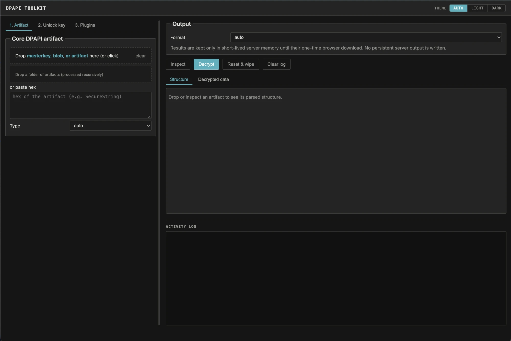

# DPAPI-toolkit

An offline toolkit for Windows DPAPI evidence. You collect the files, point the
tool at an artifact, and it recognizes the format and tells you exactly which
master key it needs; you supply the key material and it decrypts.

Most DPAPI tooling is one script per format, or a feature buried inside a larger
offensive framework. This is one tool for the whole range — master keys, DPAPI
blobs, Credential Manager, Vault, CREDHIST, Wi-Fi, RDP/RDCMan, CAPI/CNG keys and
certificates, PowerShell SecureStrings, KeePass, SCCM, Chromium `os_crypt` keys,
and (with an optional plugin) DPAPI-NG — driven from collected files alone, with
a command-line interface and a local drag-and-drop web UI over the same core.

It is built for red team and penetration testing, DFIR, and security research.
No live host, domain controller, network, BKRP, or LSASS access is used, and it
does not brute-force passwords or PINs: you supply the collected artifacts and
key material explicitly.

> **Only use this against systems and evidence you own or are explicitly
> authorized to examine.**



## Example

You've collected a user's `Protect` folder and a Credential Manager file offline
and you know the account password. Inspect the credential first — no key needed:

```bash
python3 dpapi_toolkit.py CREDENTIAL_FILE
```

It prints the embedded DPAPI blob and the master-key GUID it requires. Point it
at the `Protect` directory and let it match and unlock that master key, then
decrypt:

```bash
python3 dpapi_toolkit.py CREDENTIAL_FILE --type credential \
  --masterkey-dir Protect-S-1-5-21-... \
  --sid S-1-5-21-... \
  --password 'password'
```

The result is JSON with the target, username, and recovered credential. The same
inspect-then-decrypt flow applies to every supported format.

## Install

Python 3.10 or newer. The only hard dependency is
[`cryptography`](https://pypi.org/project/cryptography/):

```bash
python3 -m pip install cryptography
```

Optional dependencies enable specific features:

```bash
python3 -m pip install python-registry  # read Outlook data from NTUSER.DAT
python3 -m pip install dpapi-ng          # offline DPAPI-NG plugin
python3 -m pip install impacket          # offline SYSTEM/SECURITY/SAM hive plugin
```

No live Windows host, domain controller, network connection, or LSASS access is
required. Registry secrets and master keys must already have been collected.

## What it covers

- **Master keys** — user and SYSTEM, unlocked by password, NT hash, local SHA1
  hash, recovered prekey/credential key, DPAPI_SYSTEM, or an AD domain backup key.
- **Classic DPAPI blobs** and PowerShell `ConvertFrom-SecureString` /
  `Export-Clixml` SecureStrings.
- **Credential Manager**, **Windows Vault** (`.vpol`/`.vcrd`), and **CREDHIST**
  password history.
- **Wi-Fi** personal and enterprise/PEAP profiles.
- **Remote Desktop** `.rdp` files and **RDCMan** `.rdg`/`.settings`.
- **CAPI/CNG** private keys and certificates, with optional PKCS#12/PFX bundling.
- **KeePass** `ProtectedUserKey.bin`, **SCCM** policy secrets, **Outlook** IMAP,
  software-backed **Windows Hello / NGC** keys, and **Chromium** `os_crypt` keys.
- **Crackable-hash export** for offline password recovery — `$DPAPImk$` master
  keys (Hashcat 15300/15310/15900/15910), `$MSONLINEACCOUNT$` CacheData
  (mode 33700), and local SAM NT hashes. See [docs/hashes.md](docs/hashes.md).
- **DPAPI-NG** (optional plugin) for offline SID-descriptor blobs, from a
  supplied KDS root key.
- **Recursive batch mode** and a **local web UI** that share the same core.

## Identify your key material

The unlock method depends on what you already have. This maps it to the CLI
option; the same choices appear in the web UI under **2. Unlock key**.

| What you have | Size / form | Option |
|---|---:|---|
| Encrypted Windows master key | GUID-named file under `Protect` | `--masterkey FILE` plus an unlocking method |
| Decrypted master key | 64 bytes | `--real-masterkey FILE_OR_HEX_OR_BASE64` |
| SHA1 mapping of a decrypted master key | 20 bytes | `--real-masterkey FILE_OR_HEX_OR_BASE64` |
| DPAPI_SYSTEM secret | 40-byte `MachineKey \|\| UserKey`, one 20-byte key, or 44 bytes with version | `--dpapi-system FILE_OR_HEX_OR_TEXT` |
| Final SID-bound user prekey | 20 bytes | `--prekey FILE_OR_HEX` |
| NT hash | 16 bytes | `--nt-hash FILE_OR_HEX --sid SID` |
| Local SHA1 password hash | 20-byte `SHA1(password as UTF-16LE)` | `--sha1-hash FILE_OR_HEX --sid SID` |
| Unbound credential key | 16–128 bytes | `--credkey FILE_OR_HEX --sid SID` |
| AD DPAPI backup material | PEM, DER, PVK, CAPI PRIVATEKEYBLOB, or 256-byte ServerWrap key | `--domain-backup-key VALUE` or `--pvk VALUE` |

The 40/44-byte DPAPI_SYSTEM value is not a decrypted master key. Use it to
decrypt a GUID-named SYSTEM master key, then use the resulting 64-byte master key
to decrypt the artifact.

## Local web UI

The web UI is a thin front end over the same offline core, so its results match
the command line exactly:

```bash
python3 dpapi_web.py                 # http://127.0.0.1:8765/
```

It binds to `127.0.0.1` only, has no LAN/public bind option, holds decrypted
results in bounded memory for a single one-time download, and never writes
persistent decrypted output. See [docs/web-ui.md](docs/web-ui.md) for the full
workflow, the per-format flows, and the security posture.

## Documentation

| Guide | Contents |
|---|---|
| [docs/cli-reference.md](docs/cli-reference.md) | Inspection, master-key unlocking, output options, entropy, Hashcat export, batch mode, default collection locations, troubleshooting. |
| [docs/artifacts.md](docs/artifacts.md) | Per-format command examples for every supported artifact. |
| [docs/web-ui.md](docs/web-ui.md) | The local web UI: complete workflow, core artifact flows, chained recovery, and its security model. |
| [docs/plugins.md](docs/plugins.md) | Removable offline plugins (Certificate/PFX, CacheData, Windows hives, DPAPI-NG) and the DPAPI-NG walkthrough. |
| [docs/hashes.md](docs/hashes.md) | Getting crackable hashes for offline password recovery — `$DPAPImk$`, `$MSONLINEACCOUNT$`, and SAM NT hashes, with the Hashcat commands. |

Quick help is also built in: `python3 dpapi_toolkit.py -h` for short help, `-hh`
for detailed key/artifact/location/limitation help, and appending `--structure`
to any artifact prints its parsed fields without decrypting.

## Layout

| File | Purpose |
|---|---|
| `dpapi_toolkit.py` | Core parsing/decryption plus the CLI. Also importable as a module. |
| `dpapi_web.py` | Local, dependency-free web UI (standard-library HTTP server). |
| `dpapi_plugins.py` | Manifest discovery and lazy loading for the offline plugins. |
| `plugins/certificate_pfx/` | Certificate/private-key matching and offline PKCS#12/PFX creation. |
| `plugins/cachedata/` | Entra ID/CloudAP `CacheData` known-password decoder and Hashcat mode-33700 exporter. |
| `plugins/dpapi_ng/` | DPAPI-NG SID-descriptor decryption from a locally supplied KDS root key. |
| `plugins/windows_hives/` | Offline DPAPI_SYSTEM extraction and optional local SAM hash export. |

## Scope and limitations

The toolkit is intentionally offline: no outbound HTTP, RPC, domain-controller,
BKRP, LSASS, or live-registry access, and no password/PIN brute-forcing. Beyond
that:

- Classic DPAPI is fully supported. The optional DPAPI-NG plugin handles offline
  SID-descriptor blobs when the matching KDS root key is supplied; other
  protection descriptors are not supported, and it never falls back to RPC.
- Collected `SYSTEM`/`SECURITY` hives can be processed by the `windows_hives`
  plugin, or an already-extracted DPAPI_SYSTEM value supplied directly.
- Entra `CacheData` can be decrypted with one supplied known password, or
  exported as a mode-33700 verifier for external recovery; the toolkit tests no
  candidates. Other CloudAP/LSASS sources still require a supplied prekey or
  credential key.
- Only the primary encrypted section of a master-key file is tried; its local
  secondary BackupKey section is not yet used as a fallback.
- Encrypted PVK and PEM backup keys require an explicitly supplied password.
- TPM-bound Windows Hello material cannot be recovered offline from copied files.
  The NGC/PIN node chain is not yet implemented; only software CNG PIN keys are.
- CNG DSA V2 (>1024-bit) and some uncommon legacy provider blobs are not yet
  converted to PEM; their decrypted bytes are preserved.

## Acknowledgements

This is an independent implementation, but it stands on a large body of public
research and tooling on Windows DPAPI internals. Thanks to the projects and
authors whose published work made the offline algorithms here possible:

- [mimikatz](https://github.com/gentilkiwi/mimikatz) by Benjamin Delpy
  (`@gentilkiwi`) — the reference for the DPAPI master-key, blob, CREDHIST,
  Vault, and credential formats and their key derivations.
- [impacket](https://github.com/fortra/impacket) by Fortra (originally Alberto
  Solino, `@agsolino`) — its `dpapi.py`/`secretsdump` logic and registry-hive
  classes; also the optional dependency used by the SYSTEM/SECURITY/SAM hive
  plugin.
- [SharpDPAPI](https://github.com/GhostPack/SharpDPAPI) by Will Schroeder
  (`@harmj0y`) and GhostPack — cross-checks for many artifact formats and the
  Credential/Vault/CAPI/CNG paths.
- [DPAPImk2john](https://github.com/openwall/john) and the
  [hashcat](https://hashcat.net/) team — the `$DPAPImk$` hash format and modes
  15300/15310/15900/15910 that the Hashcat export targets.
- [dpapi-ng](https://github.com/jborean93/dpapi-ng) by Jordan Borean
  (`@jborean93`) — the optional library behind the offline DPAPI-NG plugin.

## License

MIT. See [LICENSE](LICENSE).
